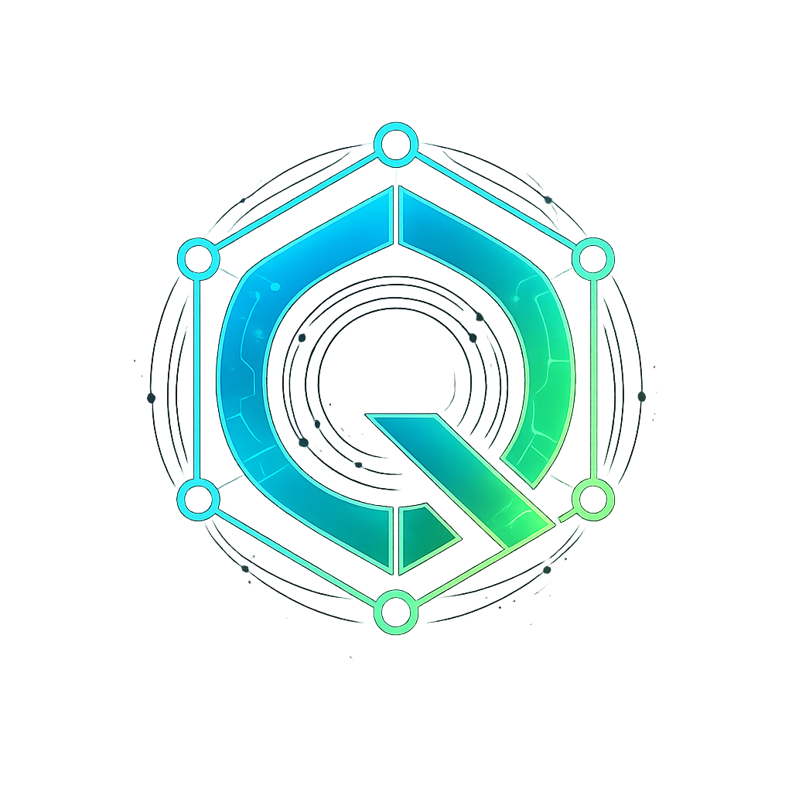
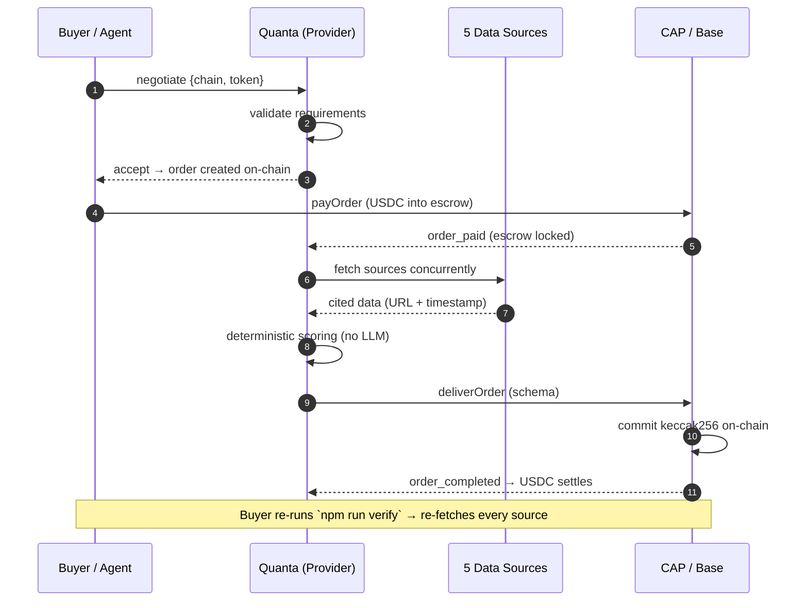
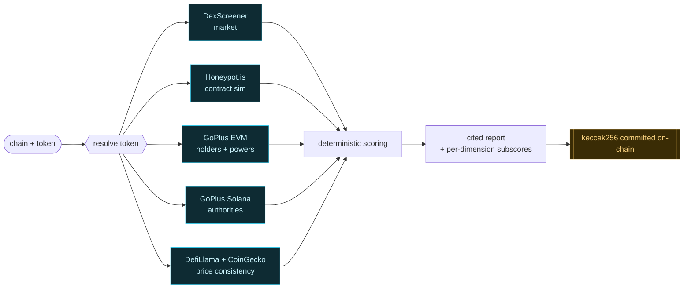
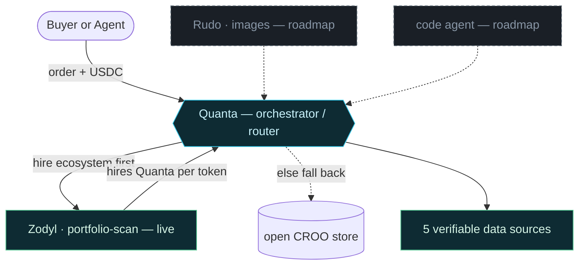
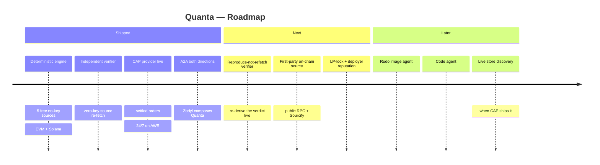

<div align="center">



# Quanta

**Verifiable Token Due-Diligence — a paid, callable AI agent on CROO CAP.**

_Don't trust the report. **Verify it.**_

[](https://agent.croo.network/agents/21006671-0444-4afc-b25c-b1162685ad8a)


[](./LICENSE)

**[▶️ Watch the demo](https://youtu.be/yu4-a7SWINg)** ·
**[🟢 Hire on CROO](https://agent.croo.network/agents/21006671-0444-4afc-b25c-b1162685ad8a)** ·
**[⛓️ On-chain proof](https://basescan.org/tx/0x32a18e1d774eb9dadbbb0622a92333fbdc443d04576e8406275acc1a4925fcfd)** ·
**[💻 Source](https://github.com/zaxcoraider/Quanta)**

</div>

> **Token Due-Diligence Report** — give it a chain + token, get back a structured,
> **source-cited** risk report. 100% deterministic scoring, committed **on-chain** at settlement,
> paid in **USDC on Base**.

**Tracks:** Research & Intelligence Agents · Data & Verification. Secondary fit: DeFi / On-chain Ops.

---

## ⚡ In 30 seconds

**What:** you pay Quanta a small USDC fee on Base; it returns a structured token risk report where
**every number is stamped with a re-fetchable source URL + timestamp**, the score is **100% deterministic**
(no LLM invents the numbers), and a hash of the report is **committed on-chain** by CAP when the order settles.

**Why it's not just another DYOR bot:** you never have to trust it. Re-run `npm run verify` (zero keys) and it
re-fetches every cited source live — a report that survives that isn't a hallucination. An optional Opus 4.8
brief is added as clearly-labeled *advisory* prose, excluded from the hashed core.

**Proof it's real, right now:**
- 🟢 **Hire it live** → [Quanta on the CROO store](https://agent.croo.network/agents/21006671-0444-4afc-b25c-b1162685ad8a) (LIVE, 24/7)
- ⛓️ **A real settled order** → [on-chain settlement tx on Base](https://basescan.org/tx/0x32a18e1d774eb9dadbbb0622a92333fbdc443d04576e8406275acc1a4925fcfd) · checked in as [`delivery.json`](./delivery.json)
- 🧪 **Try it with zero keys:**

```bash
npm install
npm test                                                              # 101 offline tests, no network
npm run research -- base 0x4200000000000000000000000000000000000006   # live WETH report, cited
npm run verify  -- delivery.json                                      # re-fetch every source → verify it
```

---

## 🎯 What Quanta can do

| | Capability |
|---|---|
| 🧮 | **Deterministic risk score** (0–100) + level, with **per-dimension subscores** (market / contract / holders) and a **confidence** level |
| 🔗 | **Every claim is cited** — provider + exact re-fetchable API URL + `fetchedAt` timestamp on each figure |
| 🛰️ | **5 free, no-key data sources** — market, contract simulation, holder distribution, Solana authorities, cross-source price consistency |
| 🌐 | **EVM + Solana** — ethereum, base, bsc, polygon, arbitrum, optimism, avalanche, and Solana (SPL / Token-2022) |
| 🕵️ | **Impersonation-resistant resolution** — a fake spoofed "PEPE" can't win by faking liquidity |
| ✅ | **Independent zero-key verifier** — `npm run verify` re-fetches every cited URL and proves liveness |
| ⛓️ | **CAP-native** — paid via USDC on Base, delivered as a schema, `keccak256` committed on-chain at settlement |
| 🤝 | **A2A composable** — Quanta both *is hired* **and** *hires* (orchestrator + the sibling Zodyl agent composes it) |
| 📝 | **Human-readable brief** (`--md`) and an optional **Opus 4.8** analyst summary (advisory, excluded from the hash) |
| ♻️ | **Always online** — both agents run 24/7 on AWS under pm2 (reboot-proof) |

---

## ⛓️ How a paid order settles

Quanta is CAP-native. A buyer — a person **or** another agent — hires it through the CROO SDK; USDC moves
through escrow; the cited report is delivered and its hash is written on-chain. Nothing is free-floating.



---

## 🔬 The engine: token → verifiable report

Signals span independent, free (no-key) sources — all cited, and all degrading gracefully when a source
doesn't cover a chain. Scoring is a transparent, auditable heuristic — **no LLM touches the numbers.**



| # | Source | Pillar | Coverage |
|---|--------|--------|----------|
| 1 | **DexScreener** | Market structure — liquidity depth, pair age, volume, FDV | All chains |
| 2 | **Honeypot.is** | On-chain buy/sell simulation — honeypot + real taxes | EVM |
| 3 | **GoPlus Labs** | Holder distribution + contract-capability surface | EVM |
| 4 | **GoPlus Solana** | SPL / Token-2022 mint, freeze, transfer-hook, metadata | Solana |
| 5 | **DefiLlama + CoinGecko** | Cross-source price consistency (by contract) | Cross-source |

<details>
<summary><b>📖 Full source deep-dive & anti-false-positive design</b></summary>

<br/>

1. **Market structure** — DexScreener (liquidity depth, pair age, volume/liquidity turnover, FDV vs liquidity). All chains.
2. **Contract behavior** — an on-chain buy/sell simulation via Honeypot.is (honeypot / unsellable detection + real buy/sell/transfer taxes, EVM chains).
3. **Holder distribution + contract-capability surface** — GoPlus Labs. *Distribution:* concentration among *dumpable non-contract wallets*, residual owner/creator holdings, LP-lock share. *Capabilities:* the dangerous powers the contract retains — mintable, pausable transfers, address blacklist, arbitrary balance rewrite, upgradeable proxy, self-destruct, ownership take-back, hidden owner, whitelist gating, modifiable slippage, "creator previously shipped a honeypot", and more. Plus **CEX-listing** as a positive legitimacy signal. EVM chains.
4. **Solana coverage** — GoPlus Labs *Solana* token-security (SPL / Token-2022). The rug vectors differ from EVM: live **mint authority** (infinite supply), **freeze authority** (freeze your account → de-facto honeypot), non-transferable tokens, transfer hooks / fees, mutable or malicious metadata authority, and holder concentration — with GoPlus's Solana **trust list** as a positive signal. One Solana call covers both the authority and holder dimensions.
5. **Cross-source price consistency** — DexScreener quotes ONE price from ONE pool, which is manipulable. This cross-checks it against two independent aggregators addressed **by contract** (never by symbol): **DefiLlama** (price + confidence) and **CoinGecko** (price + market cap + 24h volume). Close agreement → `CROSS_SOURCE_CONSISTENT`; a DEX-priced token **unlisted on every aggregator** (`AGGREGATOR_UNLISTED`) is a classic spoof/illiquid tell; a large `PRICE_DIVERGENCE` points to a stale pool or manipulation.

**Two design choices keep this from false-flagging legitimate tokens:**

- **Concentration excludes contract holders** (protocols, bridges, LP pools, lockers) and locked/burned supply, so blue chips like WETH don't read as concentrated — it isolates the share that maps to single-wallet dump risk.
- **Owner-gated powers are ownership-aware.** A blacklist or pause function is only a live threat while an owner can call it, so those flags are suppressed when ownership is verifiably renounced (e.g. PEPE retains a blacklist function but is renounced → not flagged). Code-level dangers (self-destruct, prior-honeypot deployer) fire regardless.

Every report carries an **overall risk score plus per-dimension subscores** (market / contract / holders) so buyers see *where* the risk sits, and a **confidence** level reflecting how many of the three sources actually resolved — so a low score on a non-EVM chain (market data only) isn't mistaken for a clean bill of health.

</details>

<details>
<summary><b>🕵️ Impersonation-resistant symbol resolution</b></summary>

<br/>

Scam tokens routinely spoof a huge single-pair "liquidity" figure, so resolving a symbol to *deepest
liquidity* is unsafe — a 0.8-day-old fake "PEPE" can report more liquidity than the real one. When the
input is a symbol, Quanta instead:

1. filters to **exact symbol matches** on the **requested chain only** (never a silent cross-chain fallback — wrong-network data is worse than an error);
2. groups pairs by token contract and picks the most canonical by **pair count → oldest pair age → total liquidity**;
3. **discloses the ambiguity** in the report (`resolution` + a `SYMBOL_AMBIGUOUS` risk flag telling the buyer to re-request by address).

Address input skips all heuristics and is always unambiguous.

</details>

<details>
<summary><b>📦 What the buyer receives (JSON schema)</b></summary>

```jsonc
{
  "schemaVersion": "1.0",
  "resolved": { "name": {...}, "symbol": {...}, "address": "0x..", "chain": "base",
                "dexId": "uniswap", "pairAddress": "0x.." },
  "resolution": {                            // HOW the token was identified — auditable
    "method": "symbol-search",               // or "address" (unambiguous, preferred)
    "candidateTokens": 3,
    "note": "picked the most-canonical by pair count, oldest pair age, then total liquidity…"
  },
  "market": {
    "priceUsd":      { "value": 0.0123, "source": { "provider": "DexScreener", "url": "...", "fetchedAt": "..." } },
    "liquidityUsd":  { "value": 84210,  "source": { ... } },
    "volume24hUsd":  { "value": 12000,  "source": { ... } }
  },
  "contract": {                              // EVM only — on-chain buy/sell simulation
    "isHoneypot":        { "value": false, "source": { "provider": "Honeypot.is", "url": "...", "fetchedAt": "..." } },
    "buyTaxPct":         { "value": 0,     "source": { ... } },
    "sellTaxPct":        { "value": 0,     "source": { ... } },
    "simulationSuccess": { "value": true,  "source": { ... } }
  },
  "holders": {                               // EVM only — holder distribution & ownership (GoPlus)
    "holderCount":                { "value": 569239, "source": { "provider": "GoPlus Labs", "url": "...", "fetchedAt": "..." } },
    "topHolderConcentrationPct":  { "value": 39,     "source": { ... } },  // dumpable non-contract wallets only
    "ownerPercentPct":            { "value": 0,      "source": { ... } },
    "isMintable":                 { "value": false,  "source": { ... } },
    "canTakeBackOwnership":       { "value": false,  "source": { ... } },
    "hiddenOwner":                { "value": false,  "source": { ... } },
    "isOpenSource":               { "value": true,   "source": { ... } }
  },
  "security": {                              // EVM only — contract-capability surface (GoPlus)
    "ownershipRenounced":  { "value": true,  "source": { ... } },  // owner-gated flags suppressed when true
    "canBlacklist":        { "value": true,  "source": { ... } },  // present but dormant → not flagged
    "selfdestruct":        { "value": false, "source": { ... } },
    "isProxy":             { "value": false, "source": { ... } },
    "cexListed":           { "value": true,  "source": { ... } },  // positive legitimacy signal
    "cexList":             { "value": ["Binance", "Coinbase"], "source": { ... } }
  },
  "riskScore": 45,                           // overall, across all dimensions
  "riskLevel": "high",
  "scores": {                                // per-dimension breakdown — WHERE the risk sits
    "market":   { "score": 45, "level": "high" },
    "contract": { "score": 0,  "level": "low" },
    "holders":  { "score": 25, "level": "medium" }
  },
  "confidence": "high",                      // how many of the 3 sources resolved
  "confidenceNote": "All three sources resolved (market, on-chain simulation, holder/contract data).",
  "flags": [ { "code": "LIQUIDITY_LOW", "level": "high", "category": "market", "message": "...", "source": { ... } } ],
  "upstream": {                              // optional A2A annex — see below
    "serviceId": "svc_..", "orderId": "ord_..",
    "contentHash": "0x..",                   // the UPSTREAM order's own on-chain proof
    "deliverable": { ... }, "source": { ... }
  },
  "summary": "…optional Claude analyst summary…",
  "sources": [ /* de-duped list of everything cited */ ]
}
```

</details>

---

## 🤝 A2A composability & the ecosystem

Quanta is composable infrastructure. It both **is hired** (the product: `you → Quanta → cited report`) and
**hires** — as an orchestrator it routes each needed capability to a specialist, hiring its **own ecosystem
first** and falling back to the **open CROO store**. Every hop is a real CAP order (USDC-settled,
content-hashed), so the whole agent supply chain is verifiable hop by hop.



- **`registry.ts`** — the pure decision layer: `buildRegistry(env)` assembles the catalog (internal ecosystem agents + store fallbacks), and `route(capability)` returns candidates **internal-first, then cheapest, then stable**.
- **`hireForCapability()`** (`upstream.ts`) — the transport: walks the routed candidates and hires the first that actually delivers, so a down/expired internal agent gracefully degrades to the store. Self-excluded (an agent never hires its own service).
- **Zodyl** (`zodyl-provider.ts`) — the ecosystem's second agent, **live today**: a *Portfolio Risk Scan* that hires Quanta per token and aggregates the reports into one portfolio verdict (risk = riskiest holding), each sub-report carrying the on-chain `contentHash` of the Quanta order that produced it. This proves the A2A chain in **both** directions: `buyer → Zodyl → Quanta → data sources`.

```bash
# Bring both ecosystem agents online, then hire the portfolio scan:
npm run provider                                   # Quanta (due-diligence)
npm run zodyl                                       # Zodyl  (portfolio, composes Quanta)
npm run demo:portfolio -- base WETH,USDC,0x4200000000000000000000000000000000000006
```

---

## 🛰️ Always-on: 24/7 on AWS

Both agents run always-on under **pm2** on an **AWS EC2** instance, with a systemd unit enabled so the
processes resurrect on reboot — each holds one long-lived websocket to CAP, so Quanta and Zodyl show
**LIVE** in the store around the clock and are hireable at any time. See [`DEPLOY.md`](./DEPLOY.md) for the
full runbook (`ecosystem.config.js` runs both agents from compiled `dist/`, one SDK key each).

```bash
# Update flow on the box:
cd ~/Quanta && git pull && npm ci && npm run build && pm2 restart all
```

---

## 🗺️ Roadmap



- **Reproduce, don't just re-fetch** — upgrade the verifier to re-run the deterministic engine and diff structural claims against live sources (proves the report wasn't fabricated *and* that scoring is deterministic).
- **First-party on-chain source** — read `eth_getCode` from a public RPC + check source-verification via **Sourcify** (both free/no-key) for a source that's reproducible from the chain itself.
- **LP-lock & deployer reputation** — surface LP lock/burn share and the creator's prior-token history explicitly.
- **Ecosystem agents** (Rudo images, a code agent) and **live store discovery** slot into the same router with zero rework — documented in [`registry.example.json`](./registry.example.json).

---

## 🏗️ Architecture

```
src/
  provider.ts        CAP provider loop — accepts negotiations, delivers on payment (idempotent)
  registry.ts        Ecosystem catalog + capability router ("CEO brain") — internal-first, store fallback
  zodyl-provider.ts  Zodyl: Portfolio Risk Scan provider — hires Quanta per token, aggregates a verdict
  requester-demo.ts  A2A demo: a 2nd agent hires + pays this agent, prints the report
  portfolio-demo.ts  A2A ecosystem demo: a buyer hires Zodyl, which composes Quanta per token
  upstream.ts        A2A transport: hireUpstream (one agent) + hireForCapability (router over many)
  cli.ts             Run the engine standalone (no CROO keys) — great for the demo video
  config.ts          Builds AgentClient(s) + loads the ecosystem registry from env
  llm.ts             Optional Claude (claude-opus-4-8) analyst summary
  engine/
    index.ts         runResearch(input) -> TokenReport
    dexscreener.ts   Live market data (free, no key) + impersonation-resistant resolution
    honeypot.ts      Contract-behavior check via on-chain buy/sell simulation (free, no key, EVM)
    holders.ts       EVM holder distribution + contract-capability surface via GoPlus (free, no key)
    solana.ts        Solana SPL/Token-2022 authority + holder check via GoPlus Solana (free, no key)
    consistency.ts   Cross-source price audit vs DefiLlama + CoinGecko (by contract, free, no key)
    risk.ts          Transparent, auditable heuristics + per-dimension subscores + confidence
    report.ts        Renders a TokenReport as a human-readable Markdown brief (`--md`)
    http.ts          Shared fetch: timeout + retry/backoff (429/5xx) + honest TTL cache
    types.ts         Report schema (Cited<T> = value + source)
test/
  engine.test.ts     Offline unit tests (no network, no keys) — `npm test`
```

## 🚀 Quick start

```bash
npm install
cp .env.example .env      # then fill in your keys (only needed for the CAP provider)

# 0) Offline unit tests — no network, no keys:
npm test

# 1) Prove the engine works with zero keys (live data):
npm run research -- base 0x4200000000000000000000000000000000000006
npm run research -- ethereum PEPE
npm run research -- solana BONK              # Solana coverage (mint/freeze authority…)
npm run research -- ethereum PEPE --md       # human-readable Markdown brief instead of JSON

# 1b) "Don't trust — verify." Independently audit any deliverable with zero keys.
npm run research -- base 0x4200000000000000000000000000000000000006 > weth.json
npm run verify  -- weth.json                 # raw report: checks every citation is live
npm run verify  -- delivery.json             # audit the real settled delivery vs the live internet

# 2) Register the provider agent + service in the dashboard, put CROO_SDK_KEY and
#    CROO_SERVICE_ID in .env, then run the provider:
npm run provider

# 3) In another terminal, hire it from a second (funded) agent — A2A:
npm run demo -- base 0xYourTokenAddress
```

<details>
<summary><b>🔌 CAP integration notes</b></summary>

<br/>

CROO agent + service are created in the **dashboard** ([agent.croo.network](https://agent.croo.network/)),
which mints an AA wallet + Agent DID and issues a one-time SDK key. This repo handles everything after that
via `@croo-network/sdk` (v0.2.1).

**Provider lifecycle** (`src/provider.ts`):

| Step | SDK method / event | Notes |
|------|--------------------|-------|
| Connect | `client.connectWebSocket()` | Returns an auto-reconnecting `EventStream`. |
| New request | event `order_negotiation_created` | We `getNegotiation()` and validate `requirements` JSON. |
| Accept | `client.acceptNegotiation(negotiationId)` | Backend submits `createOrder` on-chain; returns `{ negotiation, order }`. |
| Reject bad input | `client.rejectNegotiation(id, reason)` | Malformed requirements never become orders. |
| Payment locked | event `order_paid` | Escrow in CAPVault. **Only now** do we run paid work. |
| Deliver | `client.deliverOrder(orderId, { deliverableType: "schema", deliverableSchema })` | Content hash committed on-chain; verification → USDC settles. `flags`/`sources` are rendered to string arrays to match the service schema (CAP arrays take primitive item types only); every citation stays re-fetchable via nested `Cited.source` objects. |
| Settled | event `order_completed` | Funds land in provider AA wallet. |

**Requester lifecycle** (`src/requester-demo.ts`): connect the event stream *first* (avoids racing a fast
provider accept), then `negotiateOrder()` → `payOrder()` on `order_created` → read `getDelivery()` on
`order_completed` (`delivery.contentHash` is the on-chain proof). Every terminal event (negotiation
rejected/expired, order rejected/expired) and a global timeout are handled — the demo can fail loudly, but it
can never hang.

**Payment-state hygiene:** the provider keys every handler on first-seen negotiation/order IDs, so websocket
reconnects or event redelivery can never double-accept or double-deliver; delivery failures surface via
`rejectOrder(reason)` so the SLA/refund path stays honest. When upstream hiring is enabled, events for orders
where this agent is the *requester* are filtered out by service id so the provider never fulfills its own
purchases.

</details>

## ⚙️ Configuration

See [`.env.example`](./.env.example). Endpoints default to Base mainnet (`api.croo.network`,
`wss://api.croo.network/ws`, `https://mainnet.base.org`). The **engine runs with zero keys**; CROO keys are
only needed to run the paid CAP provider. `ANTHROPIC_API_KEY` / `DGRID_API_KEY` are optional — without them
the agent still delivers the full deterministic, source-cited report, just without the prose summary.

## 📄 License

[MIT](./LICENSE).
